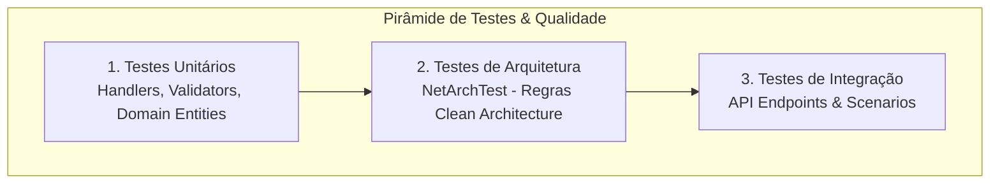

# 🧪 Quality Assurance & Automated Testing Skill

This skill defines the standardized protocol for implementing, executing, and auditing automated tests and architecture validation for the **Tech Curse API** (.NET 10, Clean Architecture, MediatR, FluentValidation, EF Core).

---

## 🔒 Mandatory Git & Branch Policy
> [!CRITICAL]
> **NEVER MANIPULATE OR TARGET THE `main` BRANCH.**
> - The base and target branch for all features, fixes, and Pull Requests is **`v1.2`**.
> - Work branches MUST branch off `v1.2` (e.g., `test/unit-tests-handlers`, `test/architecture-tests`).
> - All Pull Requests must specify `--base v1.2`.

---

## 🎯 Scope of Execution (Item 4: Testes & Garantia de Qualidade)

When executing testing tasks, follow these 3 testing pillars:



---

## 📋 Execution Protocol

### Step 1: Discover & Map Missing Tests
1. Inspect `src/Application/Features/` for all Commands, Queries, and Validators.
2. Check existing tests in `tech-curse.Test.Unit` and `tech-curse.Test.Integration`.
3. Generate a prioritized test backlog covering:
   - **Happy Path:** Valid payload returns expected response / status code.
   - **Validation Failures:** FluentValidation triggers 422 Unprocessable Entity.
   - **Security / Permissions:** `ICurrentUserService` role / user ID checks throw `NotAllowedException` / 403 Forbidden.
   - **Not Found:** Missing resource throws `NotFoundException` / 404.
   - **Conflict:** Duplicate state throws `ConflictException` / 409.

### Step 2: Implement Tests Following Clean Architecture Patterns
Refer to [Test Patterns & Templates](./references/test-patterns.md) for standard implementations:
- **Unit Testing Handlers:** Use `NSubstitute` or `Moq` for repositories, `ICacheService`, and `ICurrentUserService`.
- **Unit Testing Validators:** Test `AbstractValidator<T>` using `TestValidate` from FluentValidation.TestHelper.
- **Architecture Tests:** Use `NetArchTest.Rules` to enforce:
  - Domain layer has zero dependencies on Application, Infrastructure, or API.
  - Application layer does not depend on Infrastructure or API.
  - Controllers only communicate with Application via `IMediator`.
- **Integration Tests:** Use `WebApplicationFactory<Program>` or test fixtures.

### Step 3: Execute & Validate Test Suite
Run the test suite in the console:
```powershell
dotnet test --logger "console;verbosity=normal"
```
Ensure:
- 0 failed tests.
- Zero flaky behaviors (mock timeouts or async deadlock warnings).
- Clean execution logs.

### Step 4: Documentation & Pull Request
1. Summarize test coverage and test execution metrics.
2. Push branch to remote.
3. Open PR targeted at `v1.2` following the repository PR template with Mermaid diagrams.

---

## 📚 Detailed References
- [Test Patterns & Examples](./references/test-patterns.md)
- [Branching & Safety Guidelines](./references/branch-policy.md)
