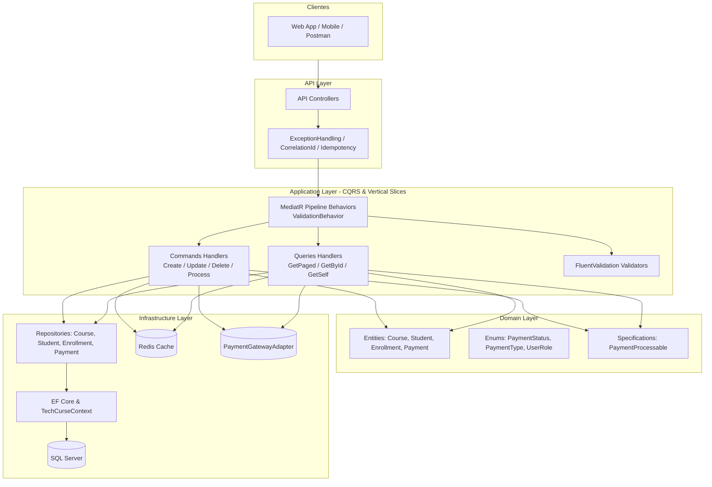

# 📄 README.md Architecture & Pattern Guide

This guide provides the blueprint for authoring a production-grade `README.md` for the **Tech Curse API**.

---

## 🏛️ Template Blueprint

```markdown
# 🎓 Tech Curse API

<p align="center">
  
  
  
  
  
  
  
</p>

## 📌 Sobre o Projeto
API RESTful empresarial desenvolvida em **.NET 10** aplicando os princípios de **Clean Architecture**, **Domain-Driven Design (DDD)** e **CQRS (Command Query Responsibility Segregation)** com **MediatR**. O sistema gerencia o ciclo completo de uma plataforma de cursos online: gestão de catálogo de cursos, ciclo de vida de estudantes, matrículas e processamento de pagamentos com estratégias e idempotência.

---

## 🏗️ Arquitetura do Sistema



---

## 🛠️ Tecnologias & Bibliotecas

| Categoria | Tecnologia / Pacote | Descrição |
| :--- | :--- | :--- |
| **Runtime & Core** | .NET 10 (C# 14), ASP.NET Core Web API | Plataforma backend de alta performance |
| **Arquitetura & CQRS** | MediatR | Implementação de Vertical Slices e Pipeline Behaviors |
| **Validação** | FluentValidation | Validação determinística de inputs e regras de negócio |
| **Persistência** | Entity Framework Core 10, SQL Server | Mapeamento objeto-relacional e migrações |
| **Cache Distribuído** | Redis (StackExchange.Redis) | Cache de listagens paginadas e chaves de idempotência |
| **Segurança & Auth** | ASP.NET Core Identity, JWT Bearer | Autenticação stateless e autorização baseada em Roles |
| **Testes Automatizados** | xUnit, Moq, FluentAssertions, NetArchTest | Testes Unitários, de Integração e de Arquitetura |
| **Documentação** | Swagger / OpenAPI (Swashbuckle) | Documentação interativa e contratos de API |

---

## 🚀 Como Executar Localmente

### Pré-requisitos
- [.NET 10 SDK](https://dotnet.microsoft.com/download/dotnet/10.0)
- [Docker](https://www.docker.com/) e Docker Compose (ou instâncias locais de SQL Server e Redis)

### Passo a Passo

```bash
# 1. Clonar o repositório
git clone https://github.com/Liuizn/tech-curse-api.git
cd tech-curse-api

# 2. Subir o ambiente com Docker Compose (SQL Server + Redis)
docker-compose up -d

# 3. Restaurar dependências e aplicar Migrations
dotnet restore
dotnet ef database update --project tech-curse/src/Infrastructure --startup-project tech-curse/src/API

# 4. Executar a API
dotnet run --project tech-curse/src/API
```

A API estará acessível em:
- **Swagger UI:** `http://localhost:5130/swagger` ou `https://localhost:7106/swagger`
- **Health Check:** `http://localhost:5130/health`

---

## 🧪 Execução dos Testes Automatizados

A solução conta com **204 testes automatizados** distribuídos em 3 projetos especializados:

```bash
# Executar toda a suíte de testes
dotnet test --logger "console;verbosity=normal"
```

1. **`tech-curse.Test.Architecture` (23 testes):** Validação de regras da Clean Architecture com NetArchTest.
2. **`tech-curse.Test.Unit` (143 testes):** Testes unitários de Handlers, Validators e Domain Specifications.
3. **`tech-curse.Test.Integration` (38 testes):** Testes ponta a ponta com `WebApplicationFactory` simulando autenticação, endpoints e middlewares.
```
