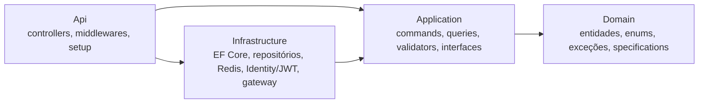

# Tech Curse API

[](https://github.com/Liuizn/tech-curse/actions/workflows/ci-cd.yml)
[](https://github.com/Liuizn/tech-curse/tags)
[](https://dotnet.microsoft.com/)
[](LICENSE)

API REST para uma plataforma de cursos — catálogo, estudantes, matrículas e pagamentos — em .NET 10 / C# 14, com Clean Architecture, CQRS por Vertical Slices (MediatR), PostgreSQL, Redis e autenticação JWT sobre ASP.NET Core Identity.

> **Escopo.** Projeto de portfólio. O gateway de pagamento é **simulado** (`SimulatedPaymentGatewayAdapter`) e, por isso, a aplicação **se recusa a subir com `ASPNETCORE_ENVIRONMENT=Production`**: um gateway que fabrica respostas confirmaria cobranças que nunca aconteceram. Implementar um adaptador real é pré-requisito para produção.

## Sumário

- [Funcionalidades](#funcionalidades)
- [Arquitetura](#arquitetura)
- [Stack](#stack)
- [Como executar](#como-executar)
- [Configuração](#configuração)
- [Autenticação e papéis](#autenticação-e-papéis)
- [Endpoints](#endpoints)
- [Segurança](#segurança)
- [Testes](#testes)
- [CI/CD e imagem](#cicd-e-imagem)
- [Decisões e limitações conhecidas](#decisões-e-limitações-conhecidas)
- [Licença](#licença)

## Funcionalidades

- **Cursos** — cadastro, edição, remoção e listagem paginada com filtro por categoria.
- **Estudantes** — perfil criado junto com o usuário no registro, consulta do próprio perfil (`/me`) e remoção lógica.
- **Matrículas** — matrícula em curso com checagem de duplicidade.
- **Pagamentos** — registro, processamento e estorno, com estratégia por meio de pagamento, especificação de elegibilidade e idempotência obrigatória via Redis.
- **Plataforma** — RBAC (`Admin`, `Instructor`, `Student`), refresh token com rotação, rate limiting, CORS configurável, logs estruturados com Serilog, Correlation ID e health checks de liveness e readiness.

## Arquitetura

Quatro projetos em `src/`, com dependências apontando para dentro:



| Camada | Responsabilidade |
| --- | --- |
| **Domain** | Entidades, enums, exceções de domínio e `ISpecification<T>`. Nenhuma dependência de outra camada, de EF Core ou de ASP.NET. |
| **Application** | Uma pasta por operação em `Features/<Recurso>/{Commands,Queries}/<Operacao>/`, cada uma com request, handler e validator. Define as interfaces que a infraestrutura implementa. |
| **Infrastructure** | `TechCurseContext`, repositórios, cache Redis, Identity/JWT e o adaptador do gateway de pagamento. |
| **Api** | Controllers finos que só conhecem `IMediator`, middlewares e a composição do container. |

Fluxo de uma requisição:

```
Controller → ExceptionHandlingMiddleware → CorrelationIdMiddleware → MediatR
           → ValidationBehavior (FluentValidation) → Handler → Repositório / Cache / Gateway
```

Handlers lançam exceções de domínio; o `ExceptionHandlingMiddleware` as converte em `ProblemDetails` com o status correspondente (404, 409, 422, 504…). As regras de dependência entre camadas e as convenções de nome são verificadas por testes de arquitetura (NetArchTest) — uma violação quebra a suíte.

## Stack

| Área | Tecnologia |
| --- | --- |
| Runtime | .NET 10, C# 14, ASP.NET Core |
| Aplicação | MediatR 12, FluentValidation 12 |
| Persistência | EF Core 10, PostgreSQL 17 (Npgsql) |
| Cache e idempotência | Redis (StackExchange.Redis) |
| Identidade | ASP.NET Core Identity, JWT Bearer |
| Observabilidade | Serilog, health checks |
| Documentação | Swashbuckle (OpenAPI) |
| Testes | xUnit, FluentAssertions, Moq, `WebApplicationFactory`, NetArchTest |
| Entrega | Docker (runtime chiseled, não-root), GitHub Actions, GHCR |

Versões de pacote centralizadas em [`Directory.Packages.props`](Directory.Packages.props).

## Como executar

Pré-requisitos: [.NET 10 SDK](https://dotnet.microsoft.com/download/dotnet/10.0) e Docker com Compose.

### Stack completa com Docker Compose

```bash
git clone https://github.com/Liuizn/tech-curse.git
cd tech-curse
cp .env.example .env
docker-compose up -d --build
```

| Serviço | Endereço |
| --- | --- |
| Swagger | http://localhost:8080/swagger |
| PostgreSQL | `localhost:5433` |
| Redis | `localhost:6380` |

O Postgres e o Redis ficam em portas não padrão de propósito, para coexistir com instâncias locais nas portas 5432 e 6379.

### API no host, dependências em contêiner

```bash
docker-compose up -d db redis
dotnet run --project src/Api
```

| Recurso | Endereço |
| --- | --- |
| Swagger | http://localhost:5130/swagger |
| Liveness | http://localhost:5130/health/live |
| Readiness | http://localhost:5130/health/ready |

Não há configuração manual: o [`appsettings.Development.json`](src/Api/appsettings.Development.json) versionado aponta para os contêineres, com credenciais descartáveis de desenvolvimento. As migrations são aplicadas no startup. Para usar outro banco sem editar o arquivo versionado, grave a connection string em User Secrets:

```bash
dotnet user-secrets set "ConnectionStrings:APITechCurse" "Host=localhost;Port=5432;Database=APITechCurse;Username=<usuario>;Password=<senha>;" --project src/Api
```

### Admin de desenvolvimento

Em `Development`, a API cria um usuário `Admin` no startup a partir de `Seed:Admin:Email` e `Seed:Admin:Password` — no compose, `SEED_ADMIN_EMAIL` e `SEED_ADMIN_PASSWORD` do `.env`. A criação é idempotente e não acontece em nenhum outro ambiente. Deixe as variáveis vazias para não semear, ou troque a senha se a máquina for acessível a outras pessoas.

## Configuração

A configuração vem de variáveis de ambiente e User Secrets; o `appsettings.json` só define logging. No compose, as chaves chegam com `__` no lugar de `:` (ex.: `Jwt__SigningKey`), alimentadas pelo `.env`.

| Chave | Descrição |
| --- | --- |
| `ConnectionStrings:APITechCurse` | Connection string do PostgreSQL (formato Npgsql) |
| `ConnectionStrings:RedisCache` | Endereço do Redis |
| `Jwt:Issuer`, `Jwt:Audience` | Emissor e audiência do token |
| `Jwt:SigningKey` | Chave de assinatura, mínimo de 32 caracteres. Gere com `openssl rand -base64 48` |
| `Jwt:RefreshTokenDays` | Validade do refresh token (padrão `7`) |
| `Cors:AllowedOrigins` | Origens permitidas, separadas por vírgula. Vazio desliga o CORS |
| `RateLimiting:Enabled` | Liga o rate limiting (padrão `true`) |
| `RateLimiting:GlobalPermitLimit` / `GlobalWindowSeconds` | Limite global (padrão 200 por 60 s) |
| `RateLimiting:AuthPermitLimit` / `AuthWindowSeconds` | Limite dos endpoints de autenticação (padrão 10 por 60 s) |
| `Seed:Admin:Email`, `Seed:Admin:Password` | Admin semeado em `Development` |

## Autenticação e papéis

| Papel | Acesso |
| --- | --- |
| `Admin` | Todos os recursos, incluindo pagamentos e gestão de usuários |
| `Instructor` | Criação de cursos |
| `Student` | Próprio perfil, próprias matrículas e pagamentos |

O registro público (`POST /tech-curse/Auth/register`) cria sempre um `Student`, já com o perfil de estudante. Outros papéis só são criados por um `Admin`, em `POST /tech-curse/Auth/users`.

Para usar o Swagger: faça login em `POST /tech-curse/Auth/login`, clique em **Authorize** e informe `Bearer <token>`.

## Endpoints

Todas as rotas ficam sob `/tech-curse/<Controller>`, com o nome do controller no singular. A referência completa está no Swagger, e a collection do Postman em [`docs/postman_collection.json`](docs/postman_collection.json) cobre todas as rotas — o login grava o token nas variáveis da collection.

| Recurso | Operações |
| --- | --- |
| `Auth` | registro, login, refresh e criação de usuário por Admin |
| `Course` | listagem paginada, detalhe, criação, edição e remoção |
| `Student` | listagem, detalhe, `/me`, matrículas do aluno, edição e remoção lógica |
| `Enrollment` | matrícula em curso |
| `Payment` | consultas por id, aluno e matrícula; registro, processamento e estorno |
| `/health/live`, `/health/ready` | liveness e readiness |

As escritas de pagamento exigem o header **`Idempotency-Key`**; sem ele a resposta é 400.

## Segurança

| Mecanismo | Implementação |
| --- | --- |
| Refresh token | Persistido como hash SHA-256, comparado em tempo constante, com rotação a cada uso |
| Rate limiting | Limite global por usuário ou IP e política mais restrita na autenticação; rejeição em `ProblemDetails` 429 com `Retry-After` |
| Lockout | 5 tentativas falhas bloqueiam a conta por 15 minutos |
| Autorização | RBAC por papel no controller; regras de posse ("é o próprio aluno") nos handlers |
| Data Protection | Chaveiro persistido no banco, sem chaves efêmeras no contêiner |
| Health checks | Readiness expõe só o status agregado; o detalhe por dependência exige `Admin` |
| Idempotência | Respostas de escrita de pagamento repetidas a partir do Redis |

## Testes

```bash
dotnet test TechCurse.slnx
```

| Projeto | Escopo |
| --- | --- |
| `TechCurse.Domain.UnitTests` | Entidades e specifications, sem mocks |
| `TechCurse.Application.UnitTests` | Handlers e validators isolados com Moq |
| `TechCurse.Api.IntegrationTests` | Endpoints HTTP, middlewares, persistência, composição do host e contratos, sobre `WebApplicationFactory` |
| `TechCurse.ArchitectureTests` | Isolamento de camadas e convenções de nome |

Os testes de integração incluem uma verificação de drift que falha se uma entidade mudar sem a migration correspondente.

## CI/CD e imagem

O workflow [`ci-cd.yml`](.github/workflows/ci-cd.yml) roda em dois jobs:

1. **Build e testes** — build, suíte completa com cobertura e auditoria de pacotes vulneráveis.
2. **Imagem** — constrói a imagem sem publicar, sobe a stack completa, sonda `/health/ready` e só então publica no GHCR os mesmos bits que passaram no smoke test.

```bash
docker pull ghcr.io/liuizn/tech-curse:latest
```

A `main` publica `latest` e `sha-<commit>`; tags `vX.Y.Z` publicam também `X.Y.Z`, `X.Y` e `X`. A imagem usa o runtime .NET chiseled — sem shell, executando como usuário não-root — com as imagens base pinadas por digest. O projeto segue [Semantic Versioning](https://semver.org/lang/pt-BR/); mudanças estão no [CHANGELOG](CHANGELOG.md).

## Decisões e limitações conhecidas

- **Gateway de pagamento simulado.** Não há integração com um provedor real, e a aplicação aborta em `Production` por isso.
- **Soft delete restrito ao aluno.** Um aluno removido não faz seus pagamentos sumirem de consultas e relatórios.
- **Migrations aplicadas no startup.** Uma falha de migration impede a API de subir. Com várias réplicas, o caminho adequado seria um job de migração dedicado antes do rollout.
- **Rate limiting em memória, por instância.** Com N réplicas, o limite efetivo é N vezes o configurado.
- **Um refresh token por usuário.** Um login em outro dispositivo invalida a sessão anterior.

## Licença

Distribuído sob a licença [Apache 2.0](LICENSE).
