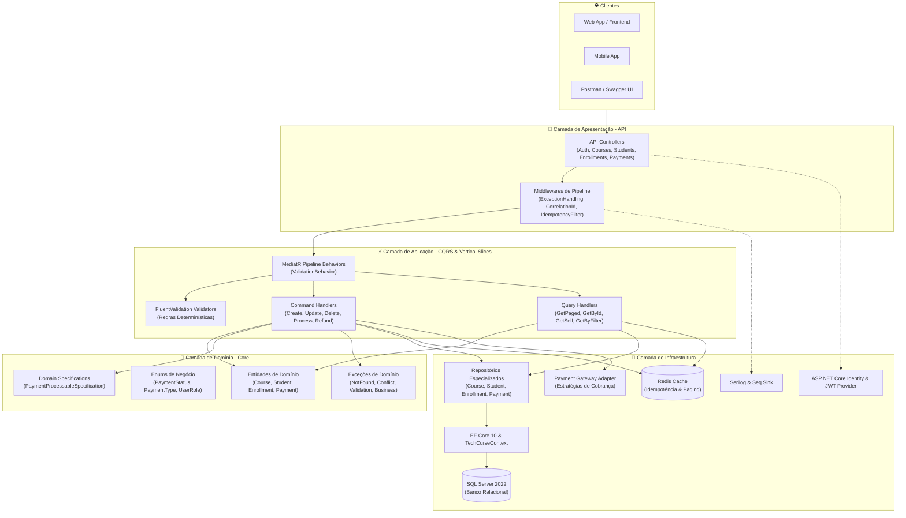
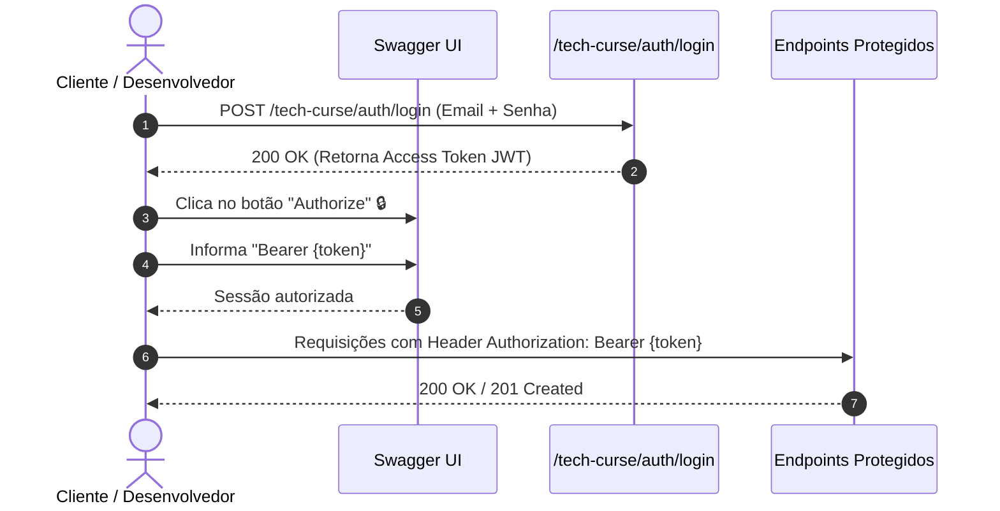
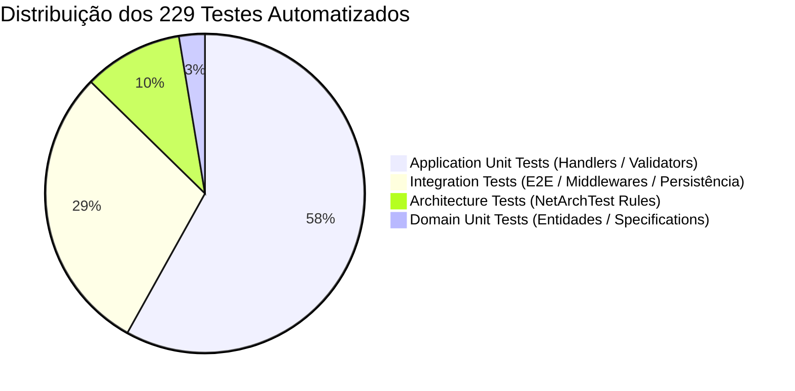

# 🎓 Tech Curse API

<p align="center">
  
  
  
  
  
  
  
  
  
</p>

---

## 📌 Visão Geral do Projeto

A **Tech Curse API** é uma API RESTful de alta performance desenvolvida em **.NET 10** e **C# 14**, arquitetada segundo os princípios de **Clean Architecture**, **Domain-Driven Design (DDD)** e **CQRS (Command Query Responsibility Segregation)** através de **Vertical Slices** com **MediatR** e **FluentValidation**.

A plataforma provê a gestão completa do ciclo de vida de uma edtech:
- 📚 **Catálogo de Cursos:** Criação, edição, desativação lógica e consultas paginadas.
- 👨‍🎓 **Gestão de Estudantes:** Ciclo de vida de alunos, perfis e consultas de autoatendimento (`/me`).
- 📝 **Matrículas Inteligentes:** Validação de duplicidade e controle de status de matrícula.
- 💳 **Processamento de Pagamentos:** Pipeline transacional com estratégias de pagamento, idempotência com Redis e estornos seguros.
- 🛡️ **Segurança & Observabilidade:** Autenticação stateless via JWT Bearer com refresh token protegido por hash, rate limiting HTTP, controle de acesso baseado em Roles (`Admin`, `Instructor`, `Student`), logs estruturados com Serilog/Seq e rastreabilidade com Correlation ID.

---

## 🏛️ Arquitetura do Sistema

A solução foi projetada desacoplando estritamente as responsabilidades de negócio das preocupações de infraestrutura e apresentação:



---

## 🛠️ Tecnologias & Bibliotecas

| Categoria | Tecnologia / Biblioteca | Versão | Descrição & Finalidade |
| :--- | :--- | :--- | :--- |
| **Runtime & Framework** | [.NET 10](https://dotnet.microsoft.com/) / C# 14 | `10.0` | Runtime de alto desempenho e recursos modernos da linguagem |
| **API Framework** | [ASP.NET Core Web API](https://learn.microsoft.com/aspnet/core/) | `10.0` | Framework web robusto para serviços HTTP RESTful |
| **Padrão Arquitetural** | [MediatR](https://github.com/jbogard/MediatR) | `12.4.1` | Implementação de CQRS, desacoplamento e Pipeline Behaviors |
| **Validação de Dados** | [FluentValidation](https://fluentvalidation.net/) | `12.1.1` | Validação determinística de contratos no pipeline da aplicação |
| **Mapeamento & ORM** | [Entity Framework Core 10](https://learn.microsoft.com/ef/core/) | `10.0.11` | ORM relacional com Migrations, Proxies e Tracking otimizado |
| **Banco de Dados Relacional** | [Microsoft SQL Server](https://www.microsoft.com/sql-server/) | `2022` | Persistência transacional com integridade referencial |
| **Cache Distribuído** | [Redis](https://redis.io/) / [StackExchange.Redis](https://stackexchange.github.io/StackExchange.Redis/) | `3.1.31` | Cache em memória para chaves de idempotência e performance |
| **Autenticação & Segurança** | [ASP.NET Core Identity](https://learn.microsoft.com/aspnet/core/security/authentication/identity) & JWT Bearer | `10.0.11` | Gestão de identidade, controle de credenciais e autorização RBAC |
| **Observabilidade & Logs** | [Serilog](https://serilog.net/) & [Seq](https://datalust.co/seq) | `10.0.0` | Logging estruturado, Correlation ID e telemetria centralizada |
| **Documentação Interativa** | [Swagger / Swashbuckle](https://github.com/domaindrivendev/Swashbuckle.AspNetCore) | `10.2.3` | OpenAPI Specification 3.0 com anotações e suporte a JWT |
| **Testes de Arquitetura** | [NetArchTest.Rules](https://github.com/BenMorris/NetArchTest) | `1.3.2` | Governança de isolamento de camadas e convenções de código |
| **Testes Automatizados** | [xUnit](https://xunit.net/), [Moq](https://github.com/devlooped/moq), [FluentAssertions](https://fluentassertions.com/) | `Latest` | Framework de testes unitários, asserções fluentes e mocking |
| **Testes de Integração** | [Microsoft.AspNetCore.Mvc.Testing](https://learn.microsoft.com/aspnet/core/test/integration-tests) | `10.0.11` | Testes ponta a ponta em memória com `WebApplicationFactory` |

---

## 🚀 Como Executar Localmente

### Pré-requisitos
- [.NET 10 SDK](https://dotnet.microsoft.com/download/dotnet/10.0) instalado.
- [Docker](https://www.docker.com/) e **Docker Compose** instalados (recomendado para SQL Server, Redis e Seq).
- Ferramenta `dotnet-ef` global (opcional para rodar migrations manualmente):
  ```bash
  dotnet tool install --global dotnet-ef
  ```

---

### Opção A: Execução Completa via Docker Compose (Recomendado)

Suba toda a infraestrutura (SQL Server, Redis, Seq e API) com um único comando:

```bash
# 1. Clonar o repositório
git clone https://github.com/Liuizn/tech-curse.git
cd tech-curse

# 2. Criar o arquivo de variáveis de ambiente a partir do exemplo
cp .env.example .env

# 3. Iniciar todos os serviços em segundo plano
docker-compose up -d --build
```

Os serviços estarão disponíveis em:
- 🌐 **API / Swagger UI:** [http://localhost:8080/swagger](http://localhost:8080/swagger)
- 📊 **Seq Dashboard:** [http://localhost:9000](http://localhost:9000)
- 🗄️ **SQL Server:** `localhost:1433`
- ⚡ **Redis:** `localhost:6380`

---

### Opção B: Execução Local com .NET CLI

Caso prefira rodar a API diretamente no host:

```bash
# 1. Subir apenas os contêineres de dependência (SQL Server, Redis, Seq)
docker-compose up -d db redis seq

# 2. Restaurar dependências da solução
dotnet restore

# 3. Aplicar as Migrations do Entity Framework Core
dotnet ef database update --project src/Infrastructure --startup-project src/Api

# 4. Executar a API em modo de Desenvolvimento
dotnet run --project src/Api
```

A API estará acessível em:
- **Swagger UI:** [http://localhost:5130/swagger](http://localhost:5130/swagger) ou [https://localhost:7106/swagger](https://localhost:7106/swagger)
- **Liveness:** [http://localhost:5130/health/live](http://localhost:5130/health/live) — responde 200 se o processo está de pé, sem consultar dependência alguma
- **Readiness:** [http://localhost:5130/health/ready](http://localhost:5130/health/ready) — agrega SQL Server e Redis. Devolve apenas o status agregado para quem não é `Admin`; o detalhe por verificação exige JWT de `Admin`

---

## 🔐 Autenticação, Autorização & Swagger

A **Tech Curse API** utiliza autenticação stateless baseada em **JSON Web Tokens (JWT)** e autorização baseada em papéis (**Role-Based Access Control - RBAC**).

### Papéis de Acesso (Roles)
- `Admin`: Acesso irrestrito a todos os recursos, relatórios, gestão de cursos, alunos e pagamentos.
- `Instructor`: Permissão para criar e atualizar catálogo de cursos.
- `Student`: Acesso a suas próprias matrículas, pagamentos e dados cadastrais (`/me`).

### Como Autenticar no Swagger UI



1. Acesse o **Swagger UI** (`/swagger`).
2. Utilize o endpoint `POST /tech-curse/auth/register` para criar um novo usuário ou `POST /tech-curse/auth/login` para autenticar.
3. Copie o token JWT retornado no campo `token`.
4. No canto superior direito do Swagger, clique no botão **Authorize 🔒**.
5. No campo **Value**, digite `Bearer ` seguido do token copiado:
   ```text
   Bearer eyJhbGciOiJIUzI1NiIsInR5cCI6IkpXVCJ9...
   ```
6. Clique em **Authorize** e feche o modal. Todas as chamadas subsequentes incluirão o header `Authorization`.

---

## 🧭 Mapa de Endpoints da API

| Módulo | Método | Rota | Acesso | Descrição |
| :--- | :---: | :--- | :---: | :--- |
| **Auth** | `POST` | `/tech-curse/Auth/register` | Público | Registra novo usuário no Identity |
| **Auth** | `POST` | `/tech-curse/Auth/login` | Público | Autentica e retorna access token + refresh token |
| **Auth** | `POST` | `/tech-curse/Auth/refresh` | Público | Rotaciona o par de tokens |
| **Course** | `GET` | `/tech-curse/Course` | Autenticado | Lista catálogo com paginação e filtro por categoria |
| **Course** | `POST` | `/tech-curse/Course` | `Admin`, `Instructor` | Cria novo curso |
| **Course** | `GET` | `/tech-curse/Course/{id}` | Autenticado | Detalha curso específico |
| **Course** | `PUT` | `/tech-curse/Course/{id}` | `Admin` | Atualiza dados de um curso |
| **Course** | `DELETE` | `/tech-curse/Course/{id}` | `Admin` | Remove curso |
| **Student** | `GET` | `/tech-curse/Student` | `Admin` | Lista estudantes cadastrados (paginado) |
| **Student** | `POST` | `/tech-curse/Student` | `Admin` | Cria registro de estudante |
| **Student** | `GET` | `/tech-curse/Student/{id}` | `Admin`, `Self` | Detalha perfil de estudante por ID |
| **Student** | `GET` | `/tech-curse/Student/{id}/enrollments` | `Admin`, `Self` | Lista as matrículas do estudante |
| **Student** | `GET` | `/tech-curse/Student/me` | `Student` | Obtém o perfil do aluno autenticado |
| **Student** | `PUT` | `/tech-curse/Student/{id}` | `Admin`, `Self` | Atualiza dados do estudante |
| **Student** | `DELETE` | `/tech-curse/Student/{id}` | `Admin` | Remoção lógica do estudante |
| **Enrollment** | `POST` | `/tech-curse/Enrollment` | Autenticado | Realiza matrícula em curso |
| **Payment** | `GET` | `/tech-curse/Payment` | `Admin` | Lista pagamentos (paginado) |
| **Payment** | `GET` | `/tech-curse/Payment/{id}` | `Admin`, `Self` | Consulta detalhes de um pagamento |
| **Payment** | `GET` | `/tech-curse/Payment/student/{studentId}` | `Admin`, `Self` | Consulta pagamentos de um aluno |
| **Payment** | `GET` | `/tech-curse/Payment/enrollment/{enrollmentId}` | `Admin`, `Self` | Consulta pagamentos de uma matrícula |
| **Payment** | `POST` | `/tech-curse/Payment` | `Admin` | Registra intenção de pagamento — exige `Idempotency-Key` |
| **Payment** | `POST` | `/tech-curse/Payment/process` | `Admin` | Processa pagamento — exige `Idempotency-Key` |
| **Payment** | `POST` | `/tech-curse/Payment/refund` | `Admin` | Estorna pagamento — exige `Idempotency-Key` |
| **Health** | `GET` | `/health/live` | Público | Liveness: responde 200 se o processo está de pé |
| **Health** | `GET` | `/health/ready` | Público | Readiness: agrega SQL Server e Redis. O detalhe por verificação exige `Admin` |

> As rotas usam o nome do controller no singular e em PascalCase (`/tech-curse/Course`, não `/courses`) — é o que `[Route("tech-curse/[controller]")]` produz. O roteamento do ASP.NET não diferencia maiúsculas, mas o plural resulta em 404.

A collection do Postman em [`docs/postman_collection.json`](docs/postman_collection.json) cobre as 25 rotas acima. Importe, rode **Auth > Login** e o script de teste grava o token nas variáveis da collection; as demais requisições o utilizam automaticamente.

---

## 🧪 Suíte de Testes Automatizados

A solução adota a cultura de qualidade estrita, contando com **229 testes automatizados (100% passing)** estruturados em 4 projetos de testes especializados:

```
📦 tests
 ┣ 📂 TechCurse.ArchitectureTests       (23 testes)  -> NetArchTest.Rules
 ┣ 📂 TechCurse.Domain.UnitTests        (6 testes)   -> Entidades, Specifications
 ┣ 📂 TechCurse.Application.UnitTests   (133 testes) -> Handlers, Validators
 ┗ 📂 TechCurse.Api.IntegrationTests    (67 testes)  -> WebApplicationFactory, Endpoints, Persistência
```

### Como Executar os Testes

```bash
# Execução completa da suíte de testes com relatório no console
dotnet test --logger "console;verbosity=normal"
```

### Detalhamento dos Projetos de Teste



1. **Testes de Arquitetura (`TechCurse.ArchitectureTests` - 23 testes):**
   - Garante que a camada de `Domain` não possui dependências de `Application`, `Infrastructure` ou `API`.
   - Assegura que `Application` depende exclusivamente de `Domain`.
   - Valida convenções de nomenclatura para Handlers, Commands, Queries, Validators e Repositórios.
2. **Testes Unitários de Domínio (`TechCurse.Domain.UnitTests` - 6 testes):**
   - Exercita entidades e especificações como `PaymentProcessableSpecification` sem mocks.
   - Referencia exclusivamente `TechCurse.Domain`, o que mantém o isolamento da camada verificável no próprio grafo de dependências.
3. **Testes Unitários de Aplicação (`TechCurse.Application.UnitTests` - 133 testes):**
   - Cobre 100% dos Handlers de Commands e Queries do MediatR com isolamento via `Moq`.
   - Valida todas as regras de validação do FluentValidation (entradas válidas, nulas, limites e formatos).
4. **Testes de Integração (`TechCurse.Api.IntegrationTests` - 67 testes):**
   - Executa fluxos ponta a ponta simulando requisições HTTP reais com `WebApplicationFactory`.
   - Valida pipeline de autenticação JWT, autorização RBAC, middlewares de exceção e idempotência.
   - Cobre persistência direta no `TechCurseContext` em `Persistence/` e a geração do documento OpenAPI.

---

## 🛡️ Endurecimento de Segurança

| Mecanismo | Implementação |
| :--- | :--- |
| **Refresh token** | Persistido como **SHA-256** em `AspNetUserTokens`, nunca em texto puro. Comparação em tempo constante via `CryptographicOperations.FixedTimeEquals` e expiração própria (`Jwt:RefreshTokenDays`, padrão 7 dias) |
| **Rate limiting** | Limiter global de 200 req/min (particionado por usuário autenticado, ou por IP quando anônimo) e política dedicada de 10 req/min por IP nos endpoints de autenticação. Rejeição devolve `ProblemDetails` 429 com `Retry-After` |
| **Data Protection** | Chaveiro persistido no banco (tabela `DataProtectionKeys`) com `SetApplicationName` fixo — sem chaves efêmeras que somem a cada recriação de contêiner |
| **Lockout de conta** | 5 tentativas falhas bloqueiam por 15 minutos (ASP.NET Core Identity) |
| **Health checks** | `/health/live` público e sem detalhe; `/health/ready` expõe status agregado a qualquer chamador, e o detalhe por verificação — que carrega endereços de servidor — apenas para `Admin` |
| **Idempotência** | Header `Idempotency-Key` obrigatório nas escritas de pagamento, com resposta replicada do Redis por 6 minutos |

Os limites de rate limiting são configuráveis por `RateLimiting:GlobalPermitLimit`, `RateLimiting:AuthPermitLimit` e equivalentes de janela.

> ⚠️ O rate limiting é **em memória, por instância**: com N réplicas o limite efetivo é N×. Um limite verdadeiramente distribuído exigiria apoiá-lo no Redis já presente na stack.

---

## ⚙️ Pipeline de CI/CD

Definido em [`.github/workflows/ci-cd.yml`](.github/workflows/ci-cd.yml), em dois jobs encadeados:

**1. Build, Tests and Publish** — restore com cache de NuGet, build, suíte completa com resultados `.trx` e cobertura publicados como artefato, auditoria de pacotes vulneráveis e publicação do artefato da aplicação.

**2. Docker Build, Smoke Test and Push** — constrói a imagem **sem publicar**, sobe a stack completa via `docker-compose.ci.yml`, sonda `/health/ready` com retry, e só então autentica no registry e publica.

```
build da imagem (load, sem push)
  └─ sobe SQL Server + Redis + Seq + API
       └─ sonda /health/ready com retry (até 150s)
            ├─ falhou → despeja logs dos contêineres e encerra SEM publicar
            └─ passou → login no GHCR → docker tag + push
```

A ordem importa: **a imagem só chega ao registry depois de provar que sobe**. E o `docker tag` + `push` no final — em vez de reconstruir com `push: true` — garante que os bits publicados são exatamente os que passaram no smoke test.

### Imagem publicada

```bash
docker pull ghcr.io/liuizn/tech-curse:latest
```

Um push na `main` publica `latest` e `sha-<commit>`. Uma tag do git no formato `v*.*.*` publica também `2.0.0`, `2.0` e `2`. As tags de versão e de SHA são o que viabiliza rollback e rastreabilidade — `latest` é sobrescrita, elas não.

A imagem usa a variante **chiseled** do runtime .NET (sem shell, sem gerenciador de pacotes, executando como usuário não-root), com as imagens base pinadas por digest para builds reproduzíveis.

---

## 📄 Licença

Este projeto está sob a licença [Apache 2.0](LICENSE). Consulte o arquivo de licença para obter mais informações.
