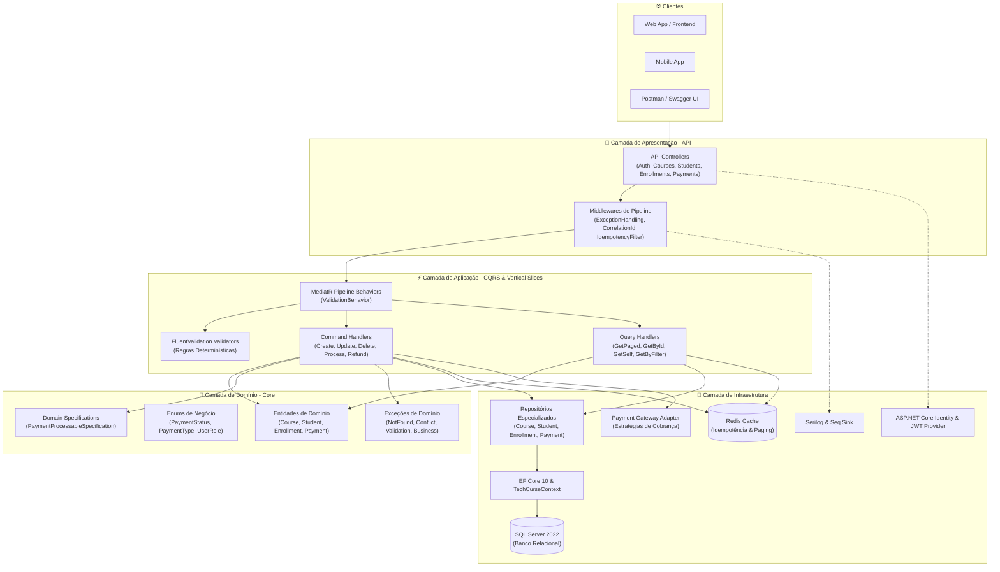
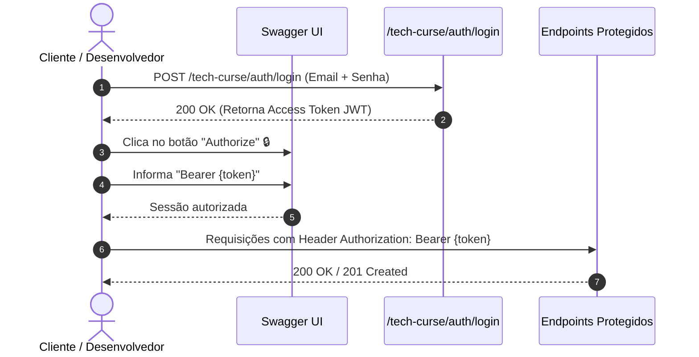
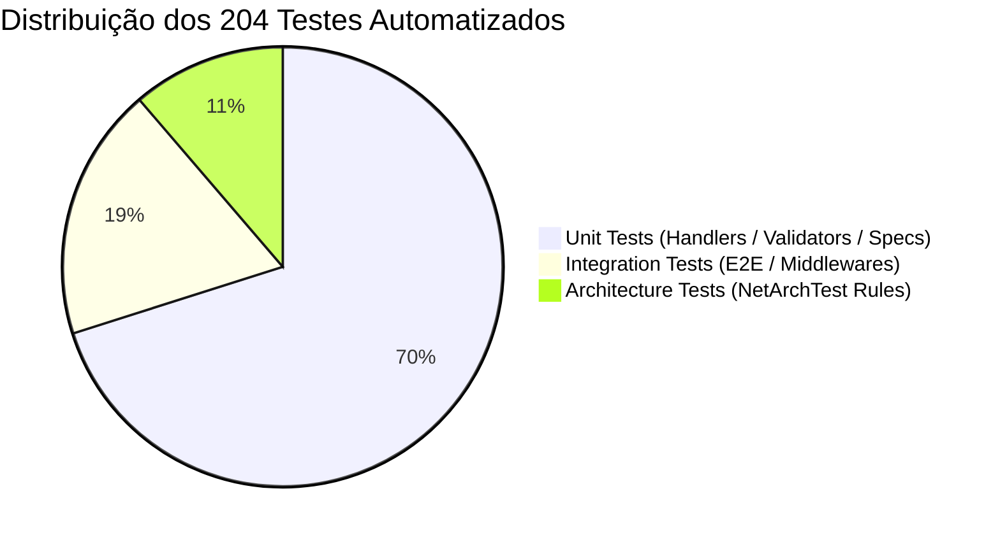

# 🎓 Tech Curse API

<p align="center">
  
  
  
  
  
  
  
  
</p>

---

## 📌 Visão Geral do Projeto

A **Tech Curse API** é uma API RESTful de alta performance desenvolvida em **.NET 10** e **C# 14**, arquitetada segundo os princípios de **Clean Architecture**, **Domain-Driven Design (DDD)** e **CQRS (Command Query Responsibility Segregation)** através de **Vertical Slices** com **MediatR** e **FluentValidation**.

A plataforma provê a gestão completa do ciclo de vida de uma edtech:
- 📚 **Catálogo de Cursos:** Criação, edição, desativação lógica e consultas paginadas.
- 👨‍🎓 **Gestão de Estudantes:** Ciclo de vida de alunos, perfis e consultas de autoatendimento (`/me`).
- 📝 **Matrículas Inteligentes:** Validação de duplicidade e controle de status de matrícula.
- 💳 **Processamento de Pagamentos:** Pipeline transacional com estratégias de pagamento, idempotência com Redis e estornos seguros.
- 🛡️ **Segurança & Observabilidade:** Autenticação stateless via JWT Bearer, controle de acesso baseado em Roles (`Admin`, `Instructor`, `Student`), logs estruturados com Serilog/Seq e rastreabilidade com Correlation ID.

---

## 🏛️ Arquitetura do Sistema

A solução foi projetada desacoplando estritamente as responsabilidades de negócio das preocupações de infraestrutura e apresentação:



---

## 🛠️ Tecnologias & Bibliotecas

| Categoria | Tecnologia / Biblioteca | Versão | Descrição & Finalidade |
| :--- | :--- | :--- | :--- |
| **Runtime & Framework** | [.NET 10](https://dotnet.microsoft.com/) / C# 14 | `10.0` | Runtime de alto desempenho e recursos modernos da linguagem |
| **API Framework** | [ASP.NET Core Web API](https://learn.microsoft.com/aspnet/core/) | `10.0` | Framework web robusto para serviços HTTP RESTful |
| **Padrão Arquitetural** | [MediatR](https://github.com/jbogard/MediatR) | `12.4.1` | Implementação de CQRS, desacoplamento e Pipeline Behaviors |
| **Validação de Dados** | [FluentValidation](https://fluentvalidation.net/) | `11.10.0` | Validação determinística de contratos no pipeline da aplicação |
| **Mapeamento & ORM** | [Entity Framework Core 10](https://learn.microsoft.com/ef/core/) | `10.0.0` | ORM relacional com Migrations, Proxies e Tracking otimizado |
| **Banco de Dados Relacional** | [Microsoft SQL Server](https://www.microsoft.com/sql-server/) | `2022` | Persistência transacional com integridade referencial |
| **Cache Distribuído** | [Redis](https://redis.io/) / [StackExchange.Redis](https://stackexchange.github.io/StackExchange.Redis/) | `3.0.17` | Cache em memória para chaves de idempotência e performance |
| **Autenticação & Segurança** | [ASP.NET Core Identity](https://learn.microsoft.com/aspnet/core/security/authentication/identity) & JWT Bearer | `10.0.0` | Gestão de identidade, controle de credenciais e autorização RBAC |
| **Observabilidade & Logs** | [Serilog](https://serilog.net/) & [Seq](https://datalust.co/seq) | `8.0.3` | Logging estruturado, Correlation ID e telemetria centralizada |
| **Documentação Interativa** | [Swagger / Swashbuckle](https://github.com/domaindrivendev/Swashbuckle.AspNetCore) | `6.6.2` | OpenAPI Specification 3.0 com anotações e suporte a JWT |
| **Testes de Arquitetura** | [NetArchTest.Rules](https://github.com/BenMorris/NetArchTest) | `1.3.2` | Governança de isolamento de camadas e convenções de código |
| **Testes Automatizados** | [xUnit](https://xunit.net/), [Moq](https://github.com/devlooped/moq), [FluentAssertions](https://fluentassertions.com/) | `Latest` | Framework de testes unitários, asserções fluentes e mocking |
| **Testes de Integração** | [Microsoft.AspNetCore.Mvc.Testing](https://learn.microsoft.com/aspnet/core/test/integration-tests) | `10.0.0` | Testes ponta a ponta em memória com `WebApplicationFactory` |

---

## 🚀 Como Executar Localmente

### Pré-requisitos
- [.NET 10 SDK](https://dotnet.microsoft.com/download/dotnet/10.0) instalado.
- [Docker](https://www.docker.com/) e **Docker Compose** instalados (recomendado para SQL Server, Redis e Seq).
- Ferramenta `dotnet-ef` global (opcional para rodar migrations manualmente):
  ```bash
  dotnet tool install --global dotnet-ef
  ```

---

### Opção A: Execução Completa via Docker Compose (Recomendado)

Suba toda a infraestrutura (SQL Server, Redis, Seq e API) com um único comando:

```bash
# 1. Clonar o repositório
git clone https://github.com/Liuizn/tech-curse-api.git
cd tech-curse-api

# 2. Criar o arquivo de variáveis de ambiente a partir do exemplo
cp .env.example .env

# 3. Iniciar todos os serviços em segundo plano
docker-compose up -d --build
```

Os serviços estarão disponíveis em:
- 🌐 **API / Swagger UI:** [http://localhost:8080/swagger](http://localhost:8080/swagger)
- 📊 **Seq Dashboard:** [http://localhost:9000](http://localhost:9000)
- 🗄️ **SQL Server:** `localhost:1433`
- ⚡ **Redis:** `localhost:6380`

---

### Opção B: Execução Local com .NET CLI

Caso prefira rodar a API diretamente no host:

```bash
# 1. Subir apenas os contêineres de dependência (SQL Server, Redis, Seq)
docker-compose up -d db redis seq

# 2. Restaurar dependências da solução
dotnet restore

# 3. Aplicar as Migrations do Entity Framework Core
dotnet ef database update --project tech-curse/src/Infrastructure --startup-project tech-curse/src/API

# 4. Executar a API em modo de Desenvolvimento
dotnet run --project tech-curse/src/API
```

A API estará acessível em:
- **Swagger UI:** [http://localhost:5130/swagger](http://localhost:5130/swagger) ou [https://localhost:7106/swagger](https://localhost:7106/swagger)
- **Health Check:** [http://localhost:5130/health](http://localhost:5130/health)

---

## 🔐 Autenticação, Autorização & Swagger

A **Tech Curse API** utiliza autenticação stateless baseada em **JSON Web Tokens (JWT)** e autorização baseada em papéis (**Role-Based Access Control - RBAC**).

### Papéis de Acesso (Roles)
- `Admin`: Acesso irrestrito a todos os recursos, relatórios, gestão de cursos, alunos e pagamentos.
- `Instructor`: Permissão para criar e atualizar catálogo de cursos.
- `Student`: Acesso a suas próprias matrículas, pagamentos e dados cadastrais (`/me`).

### Como Autenticar no Swagger UI



1. Acesse o **Swagger UI** (`/swagger`).
2. Utilize o endpoint `POST /tech-curse/auth/register` para criar um novo usuário ou `POST /tech-curse/auth/login` para autenticar.
3. Copie o token JWT retornado no campo `token`.
4. No canto superior direito do Swagger, clique no botão **Authorize 🔒**.
5. No campo **Value**, digite `Bearer ` seguido do token copiado:
   ```text
   Bearer eyJhbGciOiJIUzI1NiIsInR5cCI6IkpXVCJ9...
   ```
6. Clique em **Authorize** e feche o modal. Todas as chamadas subsequentes incluirão o header `Authorization`.

---

## 🧭 Mapa de Endpoints da API

| Módulo | Método | Rota | Acesso | Descrição |
| :--- | :---: | :--- | :---: | :--- |
| **Auth** | `POST` | `/tech-curse/auth/register` | Público | Registra novo usuário no Identity |
| **Auth** | `POST` | `/tech-curse/auth/login` | Público | Autentica e retorna JWT Token |
| **Auth** | `POST` | `/tech-curse/auth/refresh` | Público | Renova Token expirado com Refresh Token |
| **Courses** | `GET` | `/tech-curse/courses` | Público | Lista catálogo de cursos com paginação e busca |
| **Courses** | `GET` | `/tech-curse/courses/{id}` | Público | Detalha curso específico |
| **Courses** | `POST` | `/tech-curse/courses` | `Admin`, `Instructor` | Cria novo curso |
| **Courses** | `PUT` | `/tech-curse/courses/{id}` | `Admin`, `Instructor` | Atualiza dados de um curso |
| **Courses** | `DELETE` | `/tech-curse/courses/{id}` | `Admin` | Desativa curso logicamente |
| **Students** | `GET` | `/tech-curse/students` | `Admin` | Lista estudantes cadastrados (paginado) |
| **Students** | `GET` | `/tech-curse/students/{id}` | `Admin`, `Self` | Detalha perfil de estudante por ID |
| **Students** | `GET` | `/tech-curse/students/me` | `Student` | Obtém perfil do aluno autenticado |
| **Students** | `POST` | `/tech-curse/students` | `Admin`, Público | Cria registro de estudante |
| **Students** | `PUT` | `/tech-curse/students/{id}` | `Admin`, `Self` | Atualiza dados do estudante |
| **Students** | `DELETE` | `/tech-curse/students/{id}` | `Admin` | Remove cadastro de estudante |
| **Enrollments** | `POST` | `/tech-curse/enrollments` | Autenticado | Realiza matrícula em curso |
| **Enrollments** | `GET` | `/tech-curse/enrollments` | `Admin` | Lista todas as matrículas |
| **Enrollments** | `GET` | `/tech-curse/enrollments/{id}` | `Admin`, `Self` | Consulta detalhes de uma matrícula |
| **Payments** | `GET` | `/tech-curse/payment` | `Admin` | Lista pagamentos (paginado) |
| **Payments** | `GET` | `/tech-curse/payment/{id}` | `Admin`, `Self` | Consulta detalhes de um pagamento |
| **Payments** | `GET` | `/tech-curse/payment/student/{studentId}` | `Admin`, `Self` | Consulta pagamentos de um aluno |
| **Payments** | `GET` | `/tech-curse/payment/enrollment/{enrollmentId}` | `Admin`, `Self` | Consulta pagamentos de uma matrícula |
| **Payments** | `POST` | `/tech-curse/payment` | Autenticado | Registra intenção de pagamento |
| **Payments** | `POST` | `/tech-curse/payment/process` | Autenticado | Processa pagamento com idempotência |
| **Payments** | `POST` | `/tech-curse/payment/refund` | `Admin` | Estorna pagamento processado |

---

## 🧪 Suíte de Testes Automatizados

A solução adota a cultura de qualidade estrita, contando com **204 testes automatizados (100% passing)** estruturados em 3 projetos de testes especializados:

```
📦 tech-curse
 ┣ 📂 tech-curse.Test.Architecture   (23 testes)  -> NetArchTest.Rules
 ┣ 📂 tech-curse.Test.Unit           (143 testes) -> Handlers, Validators, Specs
 ┗ 📂 tech-curse.Test.Integration    (38 testes)  -> WebApplicationFactory, Endpoints
```

### Como Executar os Testes

```bash
# Execução completa da suíte de testes com relatório no console
dotnet test --logger "console;verbosity=normal"
```

### Detalhamento dos Projetos de Teste



1. **Testes de Arquitetura (`tech-curse.Test.Architecture` - 23 testes):**
   - Garante que a camada de `Domain` não possui dependências de `Application`, `Infrastructure` ou `API`.
   - Assegura que `Application` depende exclusivamente de `Domain`.
   - Valida convenções de nomenclatura para Handlers, Commands, Queries, Validators e Repositórios.
2. **Testes Unitários (`tech-curse.Test.Unit` - 143 testes):**
   - Cobre 100% dos Handlers de Commands e Queries do MediatR com isolamento via `Moq`.
   - Valida todas as regras de validação do FluentValidation (entradas válidas, nulas, limites e formatos).
   - Testa especificações de domínio como `PaymentProcessableSpecification`.
3. **Testes de Integração (`tech-curse.Test.Integration` - 38 testes):**
   - Executa fluxos ponta a ponta simulando requisições HTTP reais com `WebApplicationFactory`.
   - Valida pipeline de autenticação JWT, autorização RBAC, middlewares de exceção e idempotência.

---

## 📄 Licença

Este projeto está sob a licença [MIT](LICENSE). Consulte o arquivo de licença para obter mais informações.
